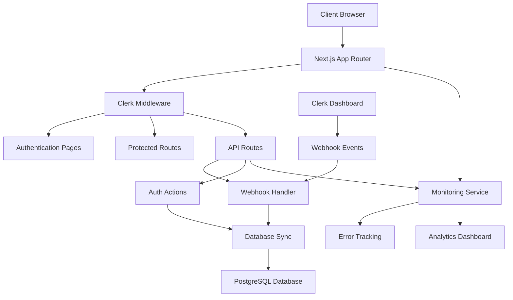
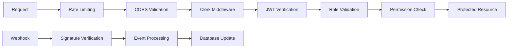

# Design Document

## Overview

This design document outlines the architecture and implementation strategy for enhancing the existing Clerk authentication system to production-grade standards. The solution builds upon the current foundation while addressing critical gaps in security, reliability, user experience, and maintainability. The design follows enterprise patterns and best practices to ensure scalability and robustness.

## Architecture

### High-Level Architecture



### Security Architecture



## Components and Interfaces

### 1. Enhanced Authentication Actions

**File:** `src/actions/auth.ts`

```typescript
interface AuthResponse {
  status: number;
  user?: User;
  message?: string;
  error?: string;
}

interface UserCreationData {
  clerkId: string;
  email: string;
  name: string | null;
  profileImage: string | null;
  role?: UserRole;
}
```

**Key Functions:**

- `onAuthenticateUser()`: Enhanced with proper error handling and logging
- `createUserFromClerk()`: Dedicated user creation with validation
- `updateUserFromClerk()`: User update synchronization
- `getUserPermissions()`: Role-based permission retrieval

### 2. Webhook Integration System

**File:** `src/app/api/webhooks/clerk/route.ts`

```typescript
interface WebhookEvent {
  type: "user.created" | "user.updated" | "user.deleted";
  data: ClerkUserData;
}

interface WebhookResponse {
  success: boolean;
  message?: string;
  error?: string;
}
```

**Event Handlers:**

- User creation synchronization
- User profile updates
- User deletion (soft delete)
- Signature verification
- Error recovery mechanisms

### 3. Enhanced Authentication Pages

**Components:**

- `SignInPage`: Custom-styled Clerk SignIn with branding
- `SignUpPage`: Custom-styled Clerk SignUp with branding
- `AuthGuard`: Loading states and authentication checks
- `AuthCallback`: Enhanced callback handling with error recovery

### 4. Role-Based Access Control (RBAC)

**File:** `src/lib/rbac.ts`

```typescript
enum UserRole {
  USER = "USER",
  MODERATOR = "MODERATOR",
  ADMIN = "ADMIN",
}

interface Permission {
  resource: string;
  action: "read" | "write" | "delete" | "admin";
  scope: "own" | "all";
}

interface RolePermissions {
  [key: string]: Permission[];
}
```

### 5. Security Middleware Enhancement

**File:** `src/middleware.ts`

Enhanced middleware with:

- Improved error handling
- Rate limiting integration
- Security headers
- Request logging
- Performance monitoring

### 6. Monitoring and Analytics

**File:** `src/lib/monitoring.ts`

```typescript
interface AuthEvent {
  type: "sign_in" | "sign_up" | "sign_out" | "auth_error";
  userId?: string;
  timestamp: Date;
  metadata: Record<string, any>;
}

interface SecurityAlert {
  level: "low" | "medium" | "high" | "critical";
  type: string;
  description: string;
  userId?: string;
  timestamp: Date;
}
```

## Data Models

### Enhanced User Model

```prisma
model User {
  id               String    @id @default(dbgenerated("gen_random_uuid()")) @db.Uuid
  email            String    @unique
  name             String?
  profileImage     String?
  clerkId          String    @unique
  role             UserRole  @default(USER)
  permissions      String[]

  // Security fields
  lastLoginAt      DateTime?
  loginAttempts    Int       @default(0)
  lockedUntil      DateTime?
  mfaEnabled       Boolean   @default(false)
  mfaSecret        String?

  // Audit fields
  createdAt        DateTime  @default(now())
  updatedAt        DateTime  @updatedAt
  deletedAt        DateTime?

  // Existing relations
  webinars         Webinar[] @relation("PresenterWebinars")
  stripeConnectId  String?   @unique
  subscription     Boolean   @default(false)
  stripeCustomerId String?   @db.VarChar(255)

  @@index([email])
  @@index([clerkId])
  @@index([role])
}

enum UserRole {
  USER
  MODERATOR
  ADMIN
}

model AuthEvent {
  id        String    @id @default(dbgenerated("gen_random_uuid()")) @db.Uuid
  type      String
  userId    String?   @db.Uuid
  success   Boolean
  ipAddress String?
  userAgent String?
  metadata  Json?
  createdAt DateTime  @default(now())

  user      User?     @relation(fields: [userId], references: [id])

  @@index([userId])
  @@index([type])
  @@index([createdAt])
}
```

## Error Handling

### Error Classification

1. **Authentication Errors**

   - Invalid credentials
   - Expired sessions
   - Missing permissions

2. **System Errors**

   - Database connection failures
   - External service unavailability
   - Configuration errors

3. **Security Errors**
   - Suspicious activity
   - Rate limit exceeded
   - Invalid webhook signatures

### Error Response Format

```typescript
interface ErrorResponse {
  error: {
    code: string;
    message: string;
    details?: any;
    timestamp: string;
    requestId: string;
  };
}
```

### Logging Strategy

```typescript
interface LogEntry {
  level: "debug" | "info" | "warn" | "error" | "fatal";
  message: string;
  context: {
    userId?: string;
    requestId: string;
    component: string;
    action: string;
  };
  metadata?: Record<string, any>;
  timestamp: Date;
}
```

## Testing Strategy

### Unit Testing

- Authentication action functions
- RBAC permission checks
- Webhook event handlers
- Error handling utilities

### Integration Testing

- Clerk authentication flow
- Database synchronization
- Webhook processing
- Middleware protection

### End-to-End Testing

- Complete authentication journeys
- Role-based access scenarios
- Error recovery flows
- Security breach simulations

### Performance Testing

- Authentication response times
- Database query optimization
- Webhook processing throughput
- Concurrent user handling

## Security Considerations

### Authentication Security

- JWT token validation
- Session management
- Multi-factor authentication
- Brute force protection

### Data Protection

- Sensitive data encryption
- PII handling compliance
- Secure data transmission
- Database security

### API Security

- Rate limiting
- CORS configuration
- Input validation
- Output sanitization

### Monitoring Security

- Security event logging
- Anomaly detection
- Threat intelligence
- Incident response

## Performance Optimization

### Database Optimization

- Proper indexing strategy
- Query optimization
- Connection pooling
- Caching implementation

### Client-Side Performance

- Code splitting
- Lazy loading
- Bundle optimization
- CDN utilization

### Server-Side Performance

- Response caching
- Database query optimization
- Async processing
- Resource pooling

## Deployment and Configuration

### Environment Configuration

```env
# Production Environment Variables
CLERK_WEBHOOK_SECRET=prod_webhook_secret
CLERK_JWT_KEY=prod_jwt_key
NEXT_PUBLIC_CLERK_DOMAIN=yourdomain.com
DATABASE_URL=production_database_url
MONITORING_API_KEY=monitoring_service_key
RATE_LIMIT_REDIS_URL=redis_connection_string
```

### Infrastructure Requirements

- PostgreSQL database with proper indexing
- Redis for session storage and rate limiting
- Monitoring service integration
- Log aggregation system
- CDN for static assets

### Scalability Considerations

- Horizontal scaling support
- Database read replicas
- Caching strategies
- Load balancing
- Auto-scaling policies

## Migration Strategy

### Phase 1: Critical Fixes

- Fix existing bugs
- Implement basic error handling
- Add proper authentication pages

### Phase 2: Security Enhancement

- Implement webhook integration
- Add RBAC system
- Enhance middleware security

### Phase 3: Advanced Features

- Add monitoring and analytics
- Implement MFA support
- Add disaster recovery

### Phase 4: Optimization

- Performance tuning
- Advanced security features
- Comprehensive testing

## Monitoring and Observability

### Key Metrics

- Authentication success/failure rates
- Response times
- Error rates
- User activity patterns
- Security events

### Alerting Strategy

- Critical error alerts
- Performance degradation warnings
- Security breach notifications
- System health monitoring

### Dashboard Requirements

- Real-time authentication metrics
- User activity analytics
- Security event monitoring
- System performance tracking
